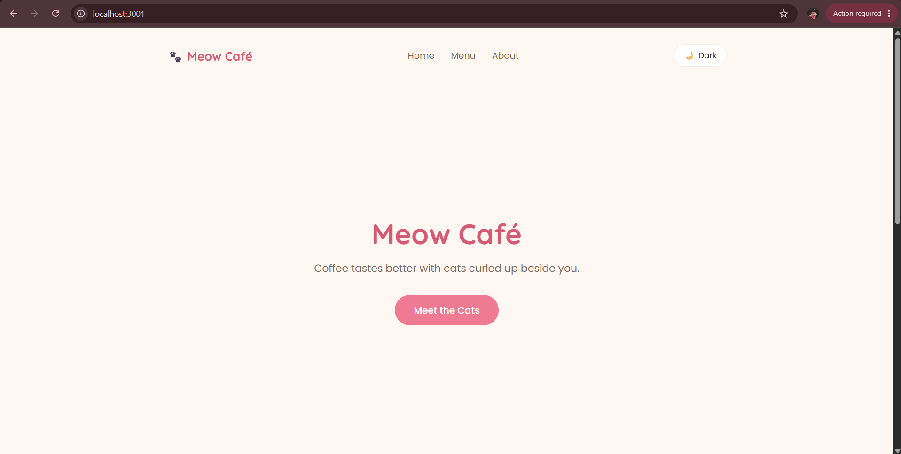
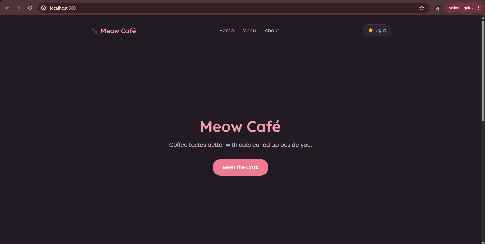

# 🐾 Meow Café

A cozy, cat-themed one-page site built to demonstrate global theme management with React's Context API — light/dark mode, persisted across refreshes, toggleable from anywhere in the component tree.

## ✨ Features

- 🎨 Light / Dark theme via ThemeContext + useContext
- 💾 Theme choice persisted in localStorage (falls back to OS preference on first visit)
- ⚡ useMemo / useCallback used in the context provider to avoid unnecessary re-renders
- 📱 Responsive navbar with a hamburger menu on mobile
- 🌸 Clean, reusable component structure (Navbar, Hero, About, MenuSection, CatCard, Footer)

## 📸 Screenshots

### Home Page (Light Mode)

### Home Page (Dark Mode)

### About Section

### Menu Section (Meet the Regulars)

### Mobile View

### Mobile Navigation Menu (Open)

## 🛠️ Tech Stack

- React 18
- Vite — build tool & dev server
- Plain CSS with CSS variables for theming (no CSS framework)

## 📁 Project Structure

src/
├── context/
│   └── ThemeContext.jsx    # Provider, useTheme hook, theme persistence
├── components/
│   ├── Navbar.jsx           # Logo, nav links, hamburger menu, theme toggle
│   ├── ThemeToggle.jsx      # Button that switches theme
│   ├── Hero.jsx             # Landing headline + CTA
│   ├── About.jsx            # "Our Story" section
│   ├── MenuSection.jsx      # Renders CatCard list
│   ├── CatCard.jsx          # Individual cat card
│   ├── CatIllustration.jsx  # SVG cat illustration
│   └── Footer.jsx
├── App.jsx
├── App.css
└── main.jsx

## 🚀 Getting Started

Clone the repo and install dependencies:

git clone https://github.com/YOUR_USERNAME/YOUR_REPO_NAME.git
cd YOUR_REPO_NAME
npm install

Run the dev server:

npm run dev

Open the printed local URL (usually http://localhost:5173).

## 🌐 Live Demo

Deployed via GitHub Pages: https://YOUR_USERNAME.github.io/YOUR_REPO_NAME/

### Deploying it yourself

npm install gh-pages --save-dev
npm run deploy

Then enable GitHub Pages in Settings → Pages, using the gh-pages branch as the source.

## 📄 License

Built as a frontend learning assignment (Context API practice). Free to use as a reference.

---

**Note:** Replace YOUR_USERNAME and YOUR_REPO_NAME with your actual GitHub username and repository name. Add your screenshots to the screenshots/ folder.
